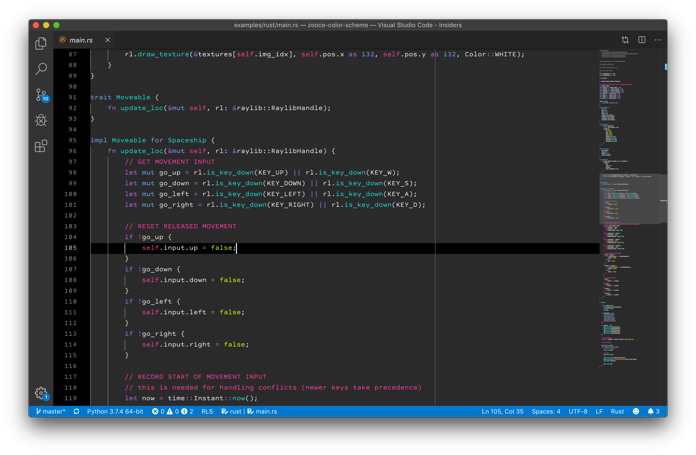
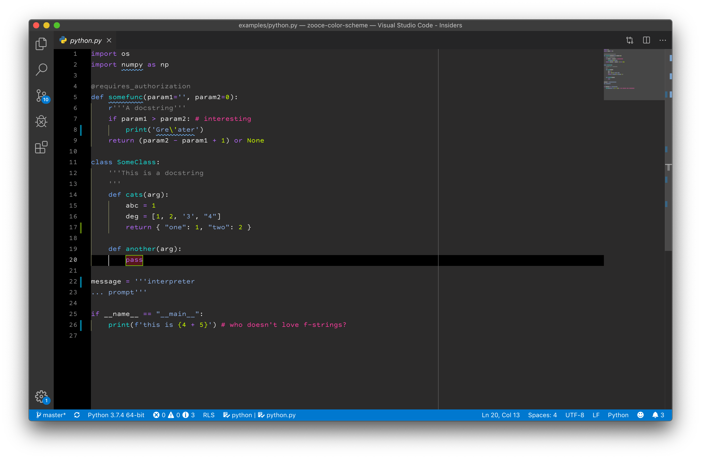
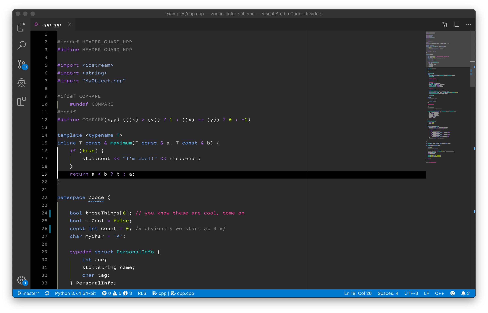
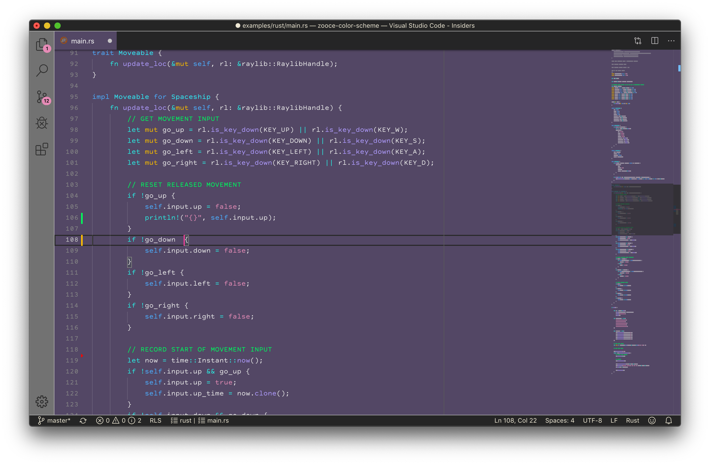
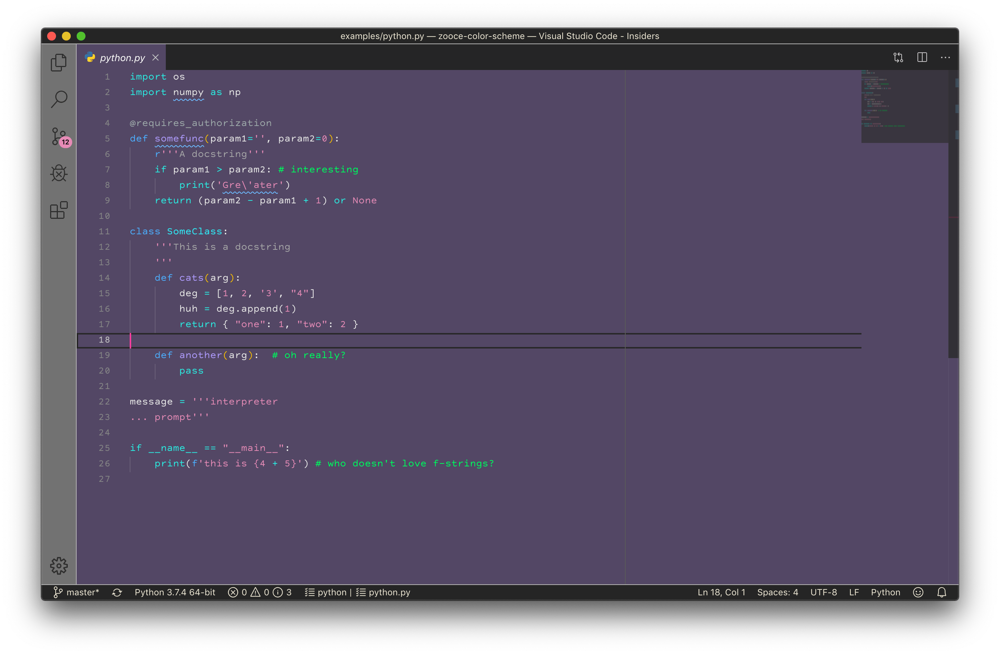
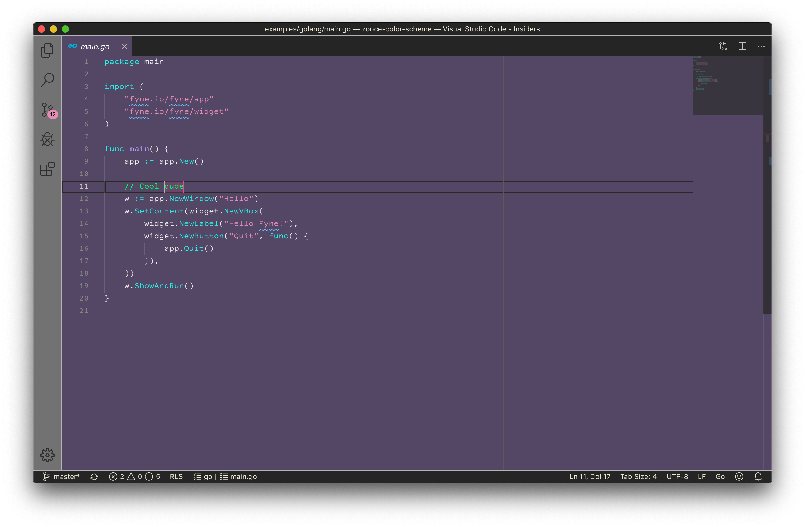

# Zooce Color Themes

These are some color themes that I periodically work on. I'm still in search of a set of themes that work well in a variety of settings, which don't hurt my eyes and are fun to look at.

My goal is to have a dark theme, a "medium" theme, and a light theme.

## Dark Theme

### Rust

### Python

### Go

### C++

## "Medium" Theme

### Rust

### Python

### Go

### C++

## Light Theme (coming soon)
